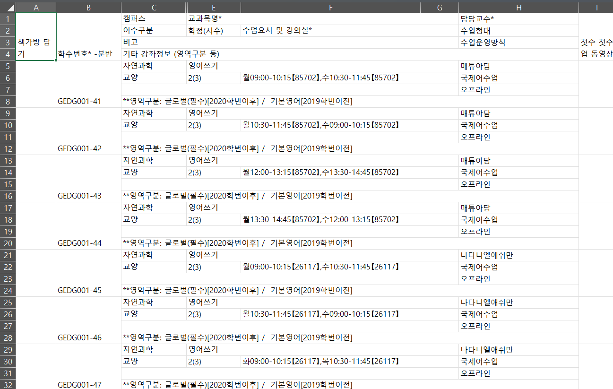
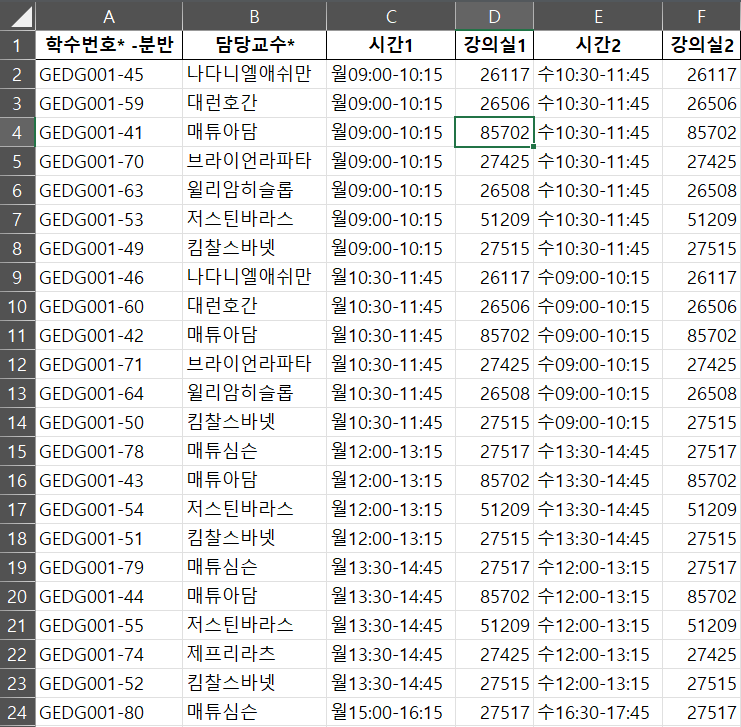

# 성균관대 CCC 클래스미팅 강의정보 추출기

# 사용방법
```
pip install pandas
python3 classmeeting.py
```

SKKU GLS -> 수업영역 -> 학사-교양/기타과목 -> 자과캠 영쓰/영발 선택 -> 표 우클릭 후 엑셀 다운로드(서식제외)

다운 받은 엑셀 파일을 코드 수정해서 넣어주시면 됩니당~ 
저 말고 쓸 사람이 있을진 모르겠지만,, 무튼 대표단 화이팅~~!

# 적용 예시
| 적용 전                           | 적용 후                           |
|-----------------------------------|-----------------------------------|
|          |            |